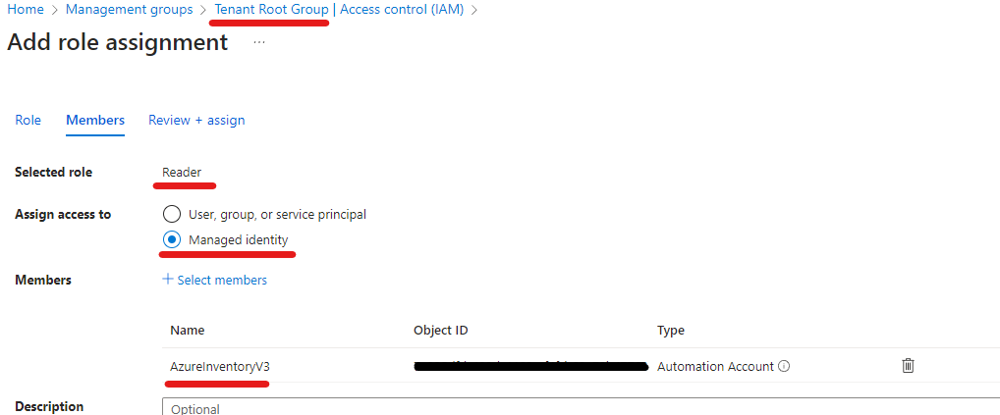
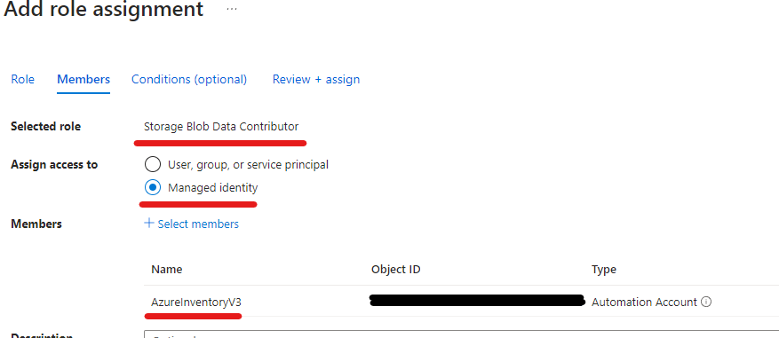
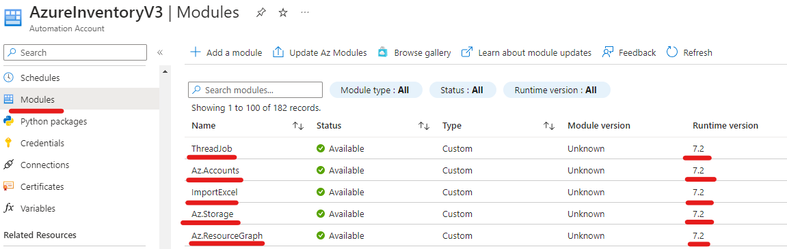
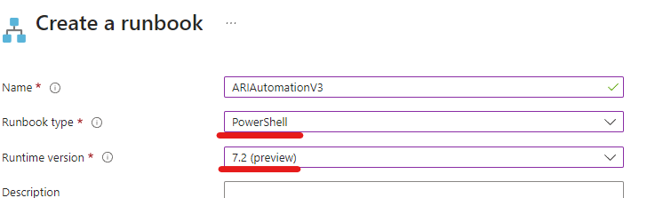
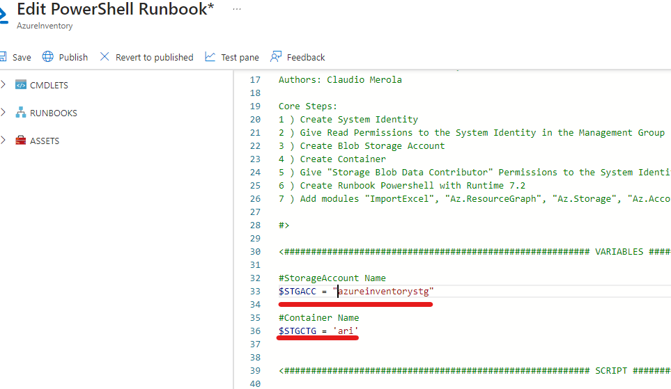

 

 

 

# Azure Resource Inventory Automation Account v3

 

 

This section explain how to create an Automation Account to run Azure Resource Inventory automatically.  

 

 

## What is required to run ARI as an Automation Account?

 

 

#### 1) Azure Automation Account
#### 2) Azure Storage Account
#### 3) Azure Blob Container inside the Storage Account

 

 

Once you have created the Automation Account, Storage Account and Blob Container. 

## Those are the steps you have to do:

 

 

### On the Automation Account, enable the System Assigned Identity:

 

 

 

 

#### This will create an identity in the Azure AD.

### Now we are going to use that identity to give the following permissions to the Automation Account:

#### 1) Reader in the Management Group (for the script to be able to read all resources from Azure):

 

 

 

 

#### 2) Storage Blob Data Contributor to the Storage Account

 

 

 

 

### Now, back in the Automation Account, the following Modules need to be imported with Runtime __7.2__:

#### 1) "ImportExcel" 
#### 2) "Az.ResourceGraph" 
#### 3) "Az.Storage" 
#### 4) "Az.Account"
#### 5) "ThreadJob"

 

 

#### This is done by going to the "Modules" then "Browse gallery":

 

 

 

 

#### Now just create a Powershell Runbook:

 

 

 

 

#### Then just copy the script content from __ARI_Automation.ps1__

 

 

 

 

Remember to change the lines 33 and 36 with your Storage Account and Container name:

 

 

 

#### Hit Save and Publish and you are ready to go.

 

