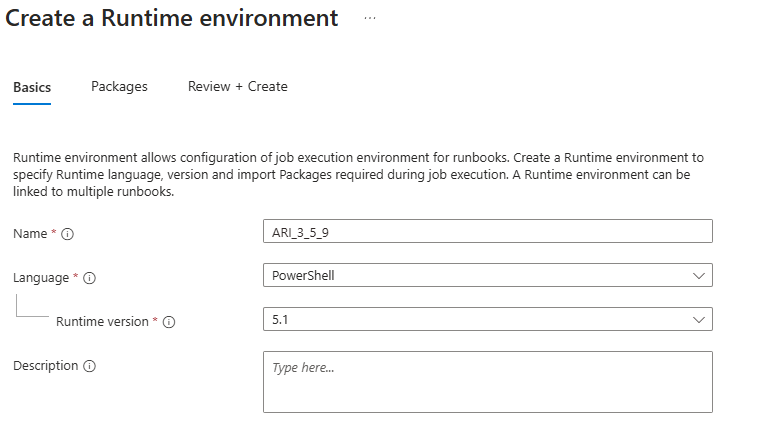
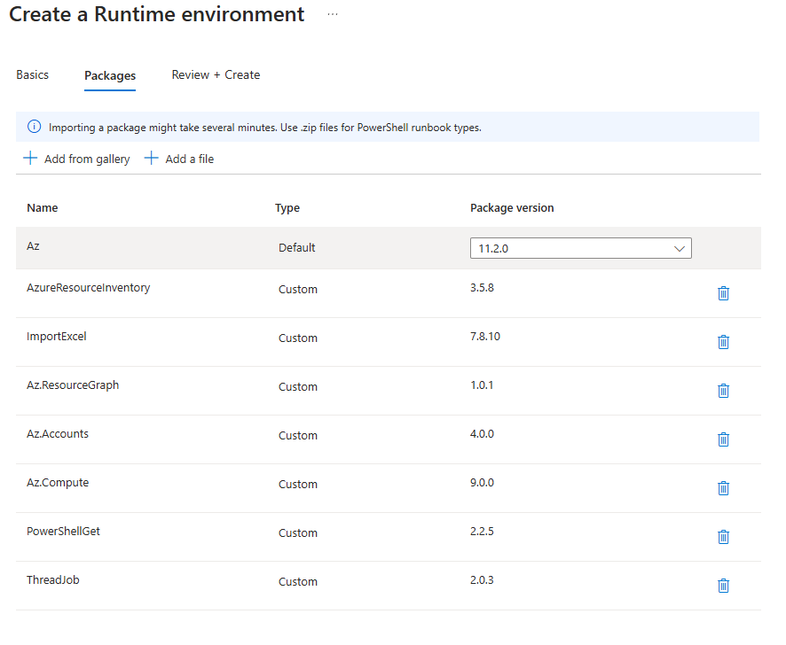
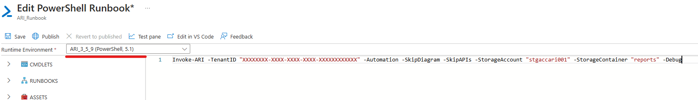

<br/>

# Azure Resource Inventory Automation Account v3.5

<br/>

<br/>

### This section explain how to create an Automation Account to run Azure Resource Inventory automatically.  

<br/>

<br/>

## What is required to run ARI as an Automation Account?

<br/>

<br/>

#### 1) Azure Automation Account
#### 2) Azure Storage Account
#### 3) Azure Blob Container inside the Storage Account

<br/>

<br/>

## These are the steps you have to do after creating the Automation Account:

<br/>

<br/>

### On the Automation Account, enable the System Assigned Identity:

<br/>

<p align="center">

</p>

<br/>

#### This will create an identity in the Entra ID.

#### Now we are going to use that identity to give the following permissions to the Automation Account:

#### 1) Reader in the Management Group (for the script to be able to read all resources from Azure):

<br/>

<p align="center">

</p>

<br/>

#### 2) Storage Blob Data Contributor to the Storage Account

<br/>

<p align="center">

</p>

<br/>

### Now, back to the Automation Account, switch to the new Runtime Environment Experience:

<br/>

<p align="center">

</p>

<br/>

### Now, create a new Runtime Environment Experience:

<br/>

<p align="center">

</p>

<br/>

### The version must be __5.1__:

<br/>

<p align="center">

</p>

<br/>


### In the "Packages" pane, import the following Modules from Gallery:

<br/>

<p align="center">

</p>

<br/>

#### 1) "AzureResourceInventory"
#### 2) "ImportExcel"
#### 3) "Az.ResourceGraph"
#### 4) "Az.Accounts"
#### 5) "Az.Compute"
#### 5) "PowershellGet"
#### 7) "ThreadJob"

<br/>


### After the Runtime finish adding all the modules, create a Powershell Runbook:

<br/>

<p align="center">

</p>

<br/>

### Now just add the "Invoke-ARI" command line inside the runbook:


<br/>


<p align="center">

</p>

<br/>

````
NOTE: Make sure to select the Runtime Environment you created.
````

<br/>

The line must contain the following parameters:

````
-TenantID
-SkipDiagram
-SkipAPIs
-Automation
-StorageAccount
-StorageContainer
````

<br/>


i.e: 

**Invoke-ARI -TenantID "XXXXXXXX-XXXX-XXXX-XXXX-XXXXXXXXXXXX" -Automation -SkipDiagram -SkipAPIs -StorageAccount "stgaccari001" -StorageContainer "reports" -Debug**


<br/>

The parameter "StorageAccount" is used to inform the Storage Account where the report will be placed and the "StorageContainer" parameter is used to inform the container within that Storage Account where the report will be placed.

<br/>

<br/>

#### Hit Save and Publish and you are ready to go.

<br/>

