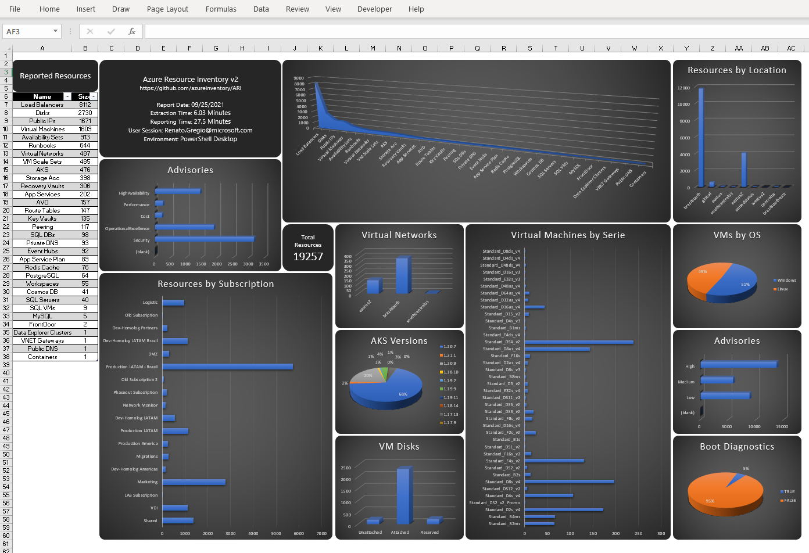
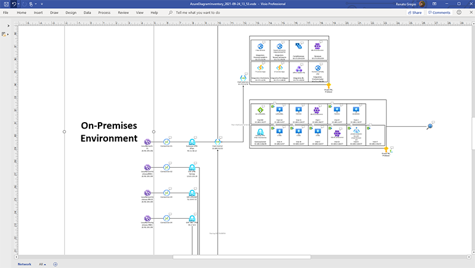
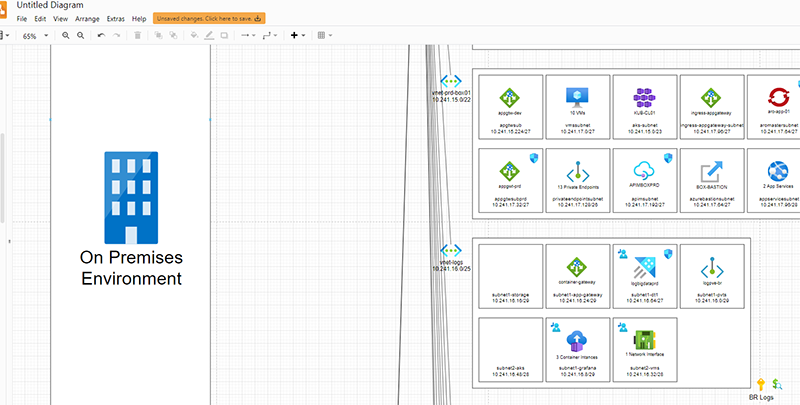
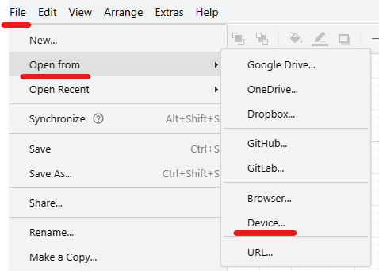
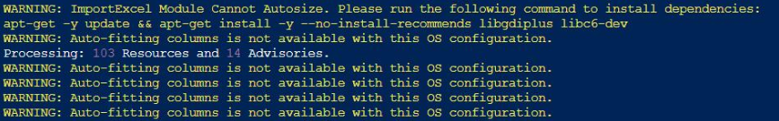
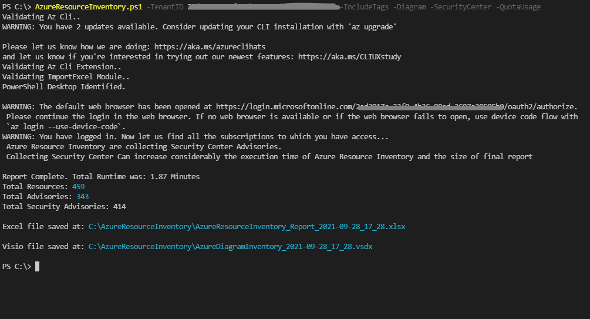
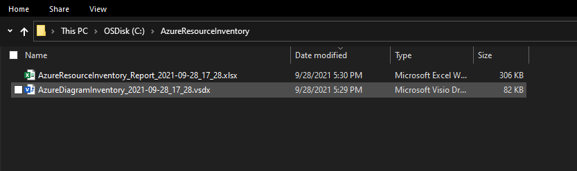

  [](https://azure.microsoft.com)


<br/>


|     Modules     |     Count     |
|-----------------|---------------|
| Compute | |
| Data | |
| Infrastructure | |
| Networking | |

<br/>


# Azure Resource Inventory v2.1

Azure Resource inventory (ARI) is a powerful script writen in powershell to generate an Excel report of any Azure Environment you have read access. 

This project is intend to help Cloud Admins and anyone that might need an easy and fast way to build a full Excel Report of an Azure Environment.  

## What's new ?

<br/>

The first big change in Azure Resource Inventory v2 is the modularization. This means all the files in the repository must be download for the script to work properly.

<br/>

- In ARI V1 we have only one Script. Authentication, Extraction, Data handling and Spreadsheet creation were made in Main Script only ( AzureResourceInventory.ps1 ). 

- In ARI V2 the code is much more efficient. The Main Script is responsable only for Authentication and Extraction. Data management and spreadsheet creation are being performed through external modules that are scanned and executed by the Main script.

<br/>

<br/>

> ### *1) New Dashboard Overview*

---------------------

<br/>

- New Dashboard with much more information and resource list linking to the sheet. 

<br/>



<br/>

<br/>

> ### *2) Azure Diagram Inventory!*

---------------------

<br/>

- The BIG Improvement for this version is Azure Diagram Inventory, two Extra Modules that creates a Microsoft Visio[^1] and a Draw.io Diagram[^2] of the Azure Network Environment. 
Since Draw.io and Microsoft Visio Diagram are additional modules. You must use the __-Diagram__ parameter for it to be generated!

#### Microsoft Visio Diagram:

<p align="center">

</p>

<br/>

#### Draw.io Diagram:

<p align="center">

</p>

<br/>

### Note:

[^1]:For the Microsoft Visio Diagram, is necessary to have Microsoft Visio installed with subscription "Visio Plan 2"

[^2]:For the Draw.io Diagram, the script will create a XML file inside the "C:\AzureResourceInventory\" folder. On Draw.io you must go to File > Import from > Device... And import the XML file that was created by the ARI script.

- For the __Microsoft Visio Diagram__, is necessary to have Microsoft Visio installed with subscription __Visio Plan 2__.

- For the __Draw.io Diagram__, the script will create a XML file inside the "C:\AzureResourceInventory\" folder. On Draw.io you must go to __File__ > __Import from__ > __Device...__ And import the XML file that was created by the script.

<br/>

<p align="center">

</p>

<br/>

<br/>

<br/>

> ### *3) Many new resource types*

---------------------

<br/>

For ARI V2 we added many more native modules ( and the possibility to create your own module ;)

#### Resources and Resource Providers:

|Resource Provider|Resource Type|
|-----------------|-------------|
|microsoft.advisor|Advisor|
|microsoft.security|Security Center| 
|microsoft.compute|Virtual Machine|
|microsoft.compute|Availability Set|
|microsoft.compute|Virtual Machine Scale Set|
|microsoft.compute|Managed Disk|
|microsoft.storage|Storage Account|
|microsoft.network|Virtual Network|
|microsoft.network|Virtual Network Peerings|
|microsoft.network|Virtual Network Gateway|
|microsoft.network|Virtual WAN|
|microsoft.network|Public IP Address|
|microsoft.network|Load Balancer|
|microsoft.network|Traffic Manager|
|microsoft.network|Application Gateways|
|microsoft.network|Frontdoor|
|microsoft.network|Route Tables|
|microsoft.network|Public DNS Zones|
|microsoft.network|Private DNS Zones|
|microsoft.network|Bastion Hosts|
|microsoft.network|Azure Firewall|
|microsoft.sqlvirtualmachine|SQL VM|
|microsoft.sql|SQL Servers|
|microsoft.sql|SQL Database|
|microsoft.dbformysql|Azure Database for MySQL|
|microsoft.dbforpostgresql|Azure Database for Postgre|
|microsoft.cache|Azure Cache for Redis|
|microsoft.documentdb|Cosmos DB|
|microsoft.databricks|Databricks|
|microsoft.kusto|Data Explorer|
|microsoft.web|App Service Plan|
|microsoft.web|App Services|
|microsoft.automation|Automation Accounts and runbooks|
|microsoft.eventhub|Event HUB|
|microsoft.servicebus|Service BUS|
|microsoft.operationalinsights|Log Analytics Workspaces|
|microsoft.containerservice|Azure Kubernetes Service|
|microsoft.redhatopenshift|Azure RedHat OpenShift|    
|microsoft.desktopvirtualization|Azure Virtual Desktop|  
|microsoft.containerinstance|Container Instances| 
|microsoft.keyvault|Key Vaults|
|microsoft.recoveryservices|Recovery Services Vault|
|microsoft.devices|IoT Hubs|
|microsoft.apimanagement|API Management|
|microsoft.streamanalytics|Streaming Analytics Jobs|

<br/>

<br/>

> ### *4) Other improvements*

---------------------

<br/>

:heavy_check_mark: Quota Usage (__-QuotaUsage__)  
:heavy_check_mark: Service Principal Authentication (__-appid__)  
:heavy_check_mark: Scan Modules diretly in GitHub ARI Repository (__-Online__)  
:heavy_check_mark: Code Review: reduce and simplify of code, Less Loopings, Bug fix, modularization  
  
<br/>
  
# Getting Started

<br/>

These instructions will get you a copy of the project up and running on your local machine or CloudShell.

<br/>

### Supportability
|Resource Provider|Results|VISIO Extension|Comments|
|-----------------|-------------|-----------------|-------------|
|Windows|Fully successfully tested|Supported|Best Results|
|MAC|Fully successfully tested|Not Tested||
|Linux|Tested on Ubuntu Desktop|Not Supported|No Table auto-fit for columns|
|CloudShell|Tested on Azure CloudShell|Not Supported|No Table auto-fit for columns|

<br/>

### Our Test Environment:   

|Tool |Version|  
|-----------------|-------------|
|Windows|10 21H1| 
|Powershell|5.1.19041.1237|  
|Az CLI|2.24.0|  
|Resource-Graph|2.1.0|
|ImportExcel|7.1.3|
|Microsoft Visio|Visio Plan 2|

<br/>

### Prerequisites

You can use Azure Resource Inventory in both in Cloudshell and Powershell Desktop. 

What things you need to run the script 

``` powershell
1. Install-Module ImportExcel
2. az cli
3. az extension add --name resource-graph
```
To install Azure CLI go to [Microsoft Docs](https://docs.microsoft.com/en-us/cli/azure/install-azure-cli) and follow the instructions to install.   

By default Azure Resource Inventory will call to install both ImportExcel module and resource-graph extension but you need to have the right privileges during the script execution. 

Special Thanks for __Doug Finke__, the Author of Powershell [ImportExcel](https://github.com/dfinke/ImportExcel) Module.    

<br/>

<br/>

## :warning: Warnings

<br/>

<span style="color:red">**Very Important:**</span> If you alread have Resource-Graph and ImplortExcel Azure Resource Inventory will not upgrade it even if your version isn't supported.

<br/>

If you're facing the bellow errors during your execution and your inventory aren't being generated check for updates in your Resource Graph extension in Az Cli.


``` powershell
1. az extension list-available --output table  ## Check if resource-graph extension upgrade is available
2. az extension update --name resource-graph
```

<br/>

<span style="color:red">**Important:**</span> If you're running the script inside Azure CloudShell the final Excel will not have Auto-fit columns and you will see warnings during the script execution (but the results of your inventory will not be changed :)



<br/>

## Running the script

<br/>

* Its really simple to use Azure Resource Inventory, all that you need to do is to call this script in PowerShell.

* Run "AzureResourceInventory.ps1". In Azure CloudShell you're already authenticated. In PowerShell Desktop you will be redirected to  Azure sign-in page. 

<br/>

  


* If you have privileges in multiple tenants you can specify the desired one by using "-TenantID" parameter or Azure Resource will scan all your tenants ID and ask you to choose one.   

<br/>


* After properly authenticated and with the TENANT selected, the Azure Resource Inventory will perform all the work of extracting and creating the inventory.
* The duration will vary according to the number of subscriptions and resources. In our tests we managed to generate in 5 minutes the inventory of a Tenant with 15 subscriptions and about 12000 resources.

* Azure ResourceInventory uses "*C:\AzureResourceInventory*" as default folder for PowerShell Desktop in Windows and "*$HOME/AzureResourceInventory*" for Azure CloudShell to save the final Excel file. 
* This file will have the name  "*AzureResourceInventory_Report_yyyy-MM-dd_HH_mm.xlsx*"  where "*yyyy-MM-dd_HH_mm*" are the date and time that this inventory was created. 

<br/>



<br/>

## Versioning and changelog

<br/>

We use [SemVer](http://semver.org/) for versioning. For the versions available, see the [tags on this repository](link-to-tags-or-other-release-location).

We also keep the `CHANGELOG.md` file in repository to Document version changes and updates.

<br/>

## Authors

The main authors of this project are:

1. Claudio Merola (clvieira@Microsoft.com).
2. Renato Gregio (Renato.Gregio@Microsoft.com)

<br/>

## Contributing

Please read our [CONTRIBUTING.md](CONTRIBUTING.md) which outlines all of our policies, procedures, and requirements for contributing to this project.

<br/>

<br/>

<br/>