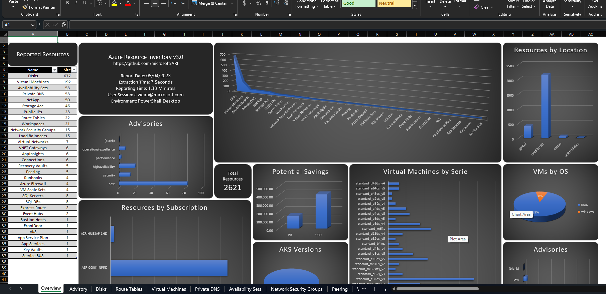

  

 

# Azure Resource Inventory

Azure Resource inventory (ARI) is a powerful script written in powershell that generates an Excel report of any Azure Environment you have read access. 

This project is intend to help Cloud Admins and anyone that might need an easy and fast way to build a full Excel Report of an Azure Environment.  

 

## What's new ?

 

### Version 3.0 is alive!!

 

Among the many improvements, those are the highlights of the new version:

 

#### 1) Support for 6 extra resource types, including NetApp and VMWare Solution.

 

Since the begining of the project, we wanted ARI to evolve and keep pace with the improvements on Azure Resources. Keeping that in mind we are adding extra modules for newer resources.

We also reviewed and updated some of the old resources as well.

 

 

#### 2) Diagram was completely rebuild and now support environments with more than 30.000 resources

 

Network Topology was cool but in large environments it had some problems (i.e.: freezing and never finishing), and even when it finished it might take forever.

We added parallel processing to diagram, now during the execution of ARI, an extra folder (DiagramCache) will be created, that folder is used by the diagram to store temporary components of the diagrams, after all the parallel processing is done those files are merged in the main diagram.

Now diagram will even finish way before the Excel file.

 

 

#### 3) Network Topology in the Diagram now identifies the Hub and Spokes Virtual Network

 

 

Tab names were added in the diagram and now the Network Topology is the first tab. 

Also in the Network Topology, we are using color in the diagram to identify the different Virtual Network usages in HUB-Spoke topologies.

Colors will also be used to indicate broken peers.

 

 

#### 4) Diagram now include "Organizational View" (Management Groups)

 

 

We added extra tabs in the new diagram, the second tab is called "Organization" and will present the hierarquical view of subscriptions in the environment.

The idea is to make easier to align your environment with the Microsoft's Landing Zone design ([What is an Azure landing zone](https://learn.microsoft.com/en-us/azure/cloud-adoption-framework/ready/landing-zone/)).

 

 

#### 5) Diagram now include Resource Overview for every subscription in the environment

 

 

Since not everyone have really complex network environments, many people complain about diagram not really presenting much for their environments. 

This change now. Every single Subscription will be a tab in the diagram, those tabs will contain the Subscription, the resource groups and the sum of every type of resource in the resource groups. By now almost every type of draw.io stencil available will be identified, with more coming in the next months.

 

 

#### 6) ARI in Automation Account

 

 

Some people were asking to run ARI in Azure Automation Account and since the old script for automation accounts was not working we managed to fix it for this version. But now is require to use Runtime 7.2 and add the modules: "ImportExcel", "Az.ResourceGraph", "Az.Storage", "Az.Account" and "ThreadJob" in the Automation Account. 

The required steps are present in the: [Automation Guide](https://github.com/microsoft/ARI/blob/main/Automation/README.md).

 

 

> ### *1) Dashboard Overview*

---------------------

 

- The main resource index in the dashboard now shows the correct number of resources and is organized accordingly. 

 

 

 

> ### *2) Azure Diagram Inventory!*

---------------------

By default everytime you run the Azure Resource Inventory the diagram will be created. 

If you do not wish to have the diagram created, you must use the __-SkipDiagram__ parameter.

Also, by default the Network Topology will not consider Virtual Networks that are connected trough peering. If you wants to include those Virtual Networks in the diagram, you must use the parameter __-DiagramFullEnvironment__.

 

#### Draw.io Diagram:

 

 

> ### *3) Extra Parameters*

---------------------

 

:heavy_check_mark: Quota Usage (__-QuotaUsage__)  
:heavy_check_mark: Service Principal Authentication (__-appid__)  
:heavy_check_mark: Scan Modules diretly in GitHub ARI Repository (__-Online__)  
:heavy_check_mark: Choose between Azure environments (__-AzureEnvironment__)
:heavy_check_mark: Network Diagram of the entire environment (__-DiagramFullEnvironment__)
:heavy_check_mark: Do not create the diagram (__-SkipDiagram__)
:heavy_check_mark: Customize the name of the report (__-ReportName__)
:heavy_check_mark: Customize the output folder of the report (__-ReportDir__)

 

# Getting Started

 

These instructions will get you a copy of the project up and running on your local machine or CloudShell.

 

### Supportability
|Resource Provider|Results|Draw.io Diagram|Comments|
|-----------------|-------------|-----------------|-------------|
|Windows|Fully successfully tested|Supported|Best Results|
|MAC|Fully successfully tested|Not Supported||
|Linux|Tested on Ubuntu Desktop|Not Supported|No Table auto-fit for columns|
|CloudShell|Tested on Azure CloudShell|Not Supported|No Table auto-fit for columns|

 

### Our Test Environment:   

|Tool |Version|  
|-----------------|-------------|
|Windows|11 22H2| 
|Powershell|5.1.19041.1237|  
|ImportExcel|7.8|
|azure-cli|2.48.1|
|AzCLI account|0.2.3|
|AzCLI resource-graph|2.1.0|

 

### Prerequisites

You can use Azure Resource Inventory in both in Cloudshell and Powershell Desktop. 

What things you need to run the script 

1. Install-Module [ImportExcel](https://github.com/dfinke/ImportExcel)
2. Install [Azure CLI](https://docs.microsoft.com/en-us/cli/azure/install-azure-cli)
3. Install Azure CLI [Account](https://docs.microsoft.com/en-us/cli/azure/azure-cli-extensions-list) Extension
4. Install Azure CLI [Resource-Graph](https://docs.microsoft.com/en-us/cli/azure/azure-cli-extensions-list) Extension

By default Azure Resource Inventory will call to install the required Powershell modules and Azure CLI components but you must have administrator privileges during the script execution. 

Special Thanks for __Doug Finke__, the Author of Powershell [ImportExcel](https://github.com/dfinke/ImportExcel) Module.    

 

 

## :warning: Warnings

 

**Very Important:** Azure Resource Inventory will not upgrade the current version of the Powershell modules.

 

**Important:** If you're running the script inside Azure CloudShell the final Excel will not have Auto-fit columns and you will see warnings during the script execution (but the results of your inventory will not be changed :)

 

## Running the script

 

* Its really simple to use Azure Resource Inventory, all that you need to do is to call this script in PowerShell.

* Run "AzureResourceInventory.ps1". In Azure CloudShell you're already authenticated. In PowerShell Desktop you will be redirected to  Azure sign-in page. 

 

  

* If you have privileges in multiple tenants you can specify the desired one by using "-TenantID" parameter or Azure Resource will scan all your tenants ID and ask you to choose one.   

 

* After properly authenticated and with the TENANT selected, the Azure Resource Inventory will perform all the work of extracting and creating the inventory.
* The duration will vary according to the number of subscriptions and resources. In our tests we managed to generate in 5 minutes the inventory of a Tenant with 15 subscriptions and about 12000 resources.

* Azure ResourceInventory uses "*C:\AzureResourceInventory*" as default folder for PowerShell Desktop in Windows and "*$HOME/AzureResourceInventory*" for Azure CloudShell to save the final Excel file. 
* This file will have the name  "*AzureResourceInventory_Report_yyyy-MM-dd_HH_mm.xlsx*"  where "*yyyy-MM-dd_HH_mm*" are the date and time that this inventory was created. 

 

## Versioning and changelog

 

We use [SemVer](http://semver.org/) for versioning. For the versions available, see the [tags on this repository](link-to-tags-or-other-release-location).

We also keep the `CHANGELOG.md` file in repository to Document version changes and updates.

 

## Authors

The main authors of this project are:

1. Claudio Merola (claudio.merola@microsoft.com)
2. Renato Gregio

 

 

## Contributing

Please read our [CONTRIBUTING.md](CONTRIBUTING.md) which outlines all of our policies, procedures, and requirements for contributing to this project.

 

 

----------------------------------------------------------------------

 

## About the tool

 

Copyright (c) 2018 Microsoft Corporation. All rights reserved.

 

THE SOFTWARE IS PROVIDED "AS IS", WITHOUT WARRANTY OF ANY KIND, EXPRESS OR
IMPLIED, INCLUDING BUT NOT LIMITED TO THE WARRANTIES OF MERCHANTABILITY,
FITNESS FOR A PARTICULAR PURPOSE AND NONINFRINGEMENT. IN NO EVENT SHALL THE
AUTHORS OR COPYRIGHT HOLDERS BE LIABLE FOR ANY CLAIM, DAMAGES OR OTHER
LIABILITY, WHETHER IN AN ACTION OF CONTRACT, TORT OR OTHERWISE, ARISING FROM,
OUT OF OR IN CONNECTION WITH THE SOFTWARE OR THE USE OR OTHER DEALINGS IN
THE SOFTWARE.

 

----------------------------------------------------------------------

 

## Trademarks

 

This project may contain trademarks or logos for projects, products, or services. Authorized use of Microsoft trademarks or logos is subject to and must follow [Microsoft’s Trademark & Brand Guidelines](https://www.microsoft.com/en-us/legal/intellectualproperty/trademarks). Use of Microsoft trademarks or logos in modified versions of this project must not cause confusion or imply Microsoft sponsorship. Any use of third-party trademarks or logos are subject to those third-party’s policies.

 
