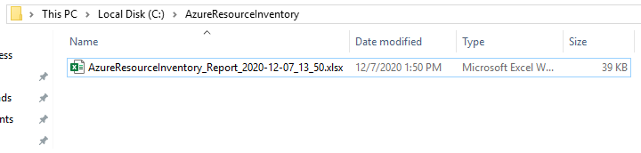

# Azure Resource Inventory

Azure Resource inventory is a powerful script writen in powershell to generate an Excel report of any Azure Environment you have read access (Virtual Machines, AKS Clusters, SQL DBs, Event Hubs, etc.).

This project is intend to help Cloud Admins and anyone that might need an easy and fast way to build a full Excel Report of an Azure Environment.


### Resources and Resource Providers
Until this documentation Azure Resource inventory was able to collect Azure Security Center (Unhealth only), Azure Advisor, 22 Azure resource types from 15 different Azure resource providers and this list are increasing fast.

|Resource Provider|Resource Type|
|-----------------|-------------|
|microsoft.advisor|recommendations|
|microsoft.security|assessments| 
|microsoft.compute|virtualmachines|
|microsoft.compute|availabilitysets|
|microsoft.compute|virtualmachinescalesets|
|microsoft.compute|disks|
|microsoft.storage|storageaccounts|
|microsoft.network|virtualnetworks|
|microsoft.network|virtualnetworks|
|microsoft.network|virtualnetworkgateways|
|microsoft.network|publicipaddresses|
|microsoft.network|loadbalancers|
|microsoft.sqlvirtualmachine|sqlvirtualmachines|
|microsoft.sql|servers/databases|
|microsoft.dbformysql|servers|
|microsoft.dbforpostgresql|servers|
|microsoft.web|serverfarms|
|microsoft.automation|automationaccounts/runbooks|
|microsoft.eventhub|namespaces|
|microsoft.operationalinsights|workspaces|
|microsoft.containerservice|managedclusters|  
|microsoft.containerinstance|containergroups| 
|microsoft.web|sites|
|microsoft.sql|servers|


## Getting Started

These instructions will get you a copy of the project up and running on your local machine or CloudShell.

### Prerequisites

You can use Azure Resource Inventory in both in Cloudshell and Powershell Desktop. 

What things you need to run the script 

``` powershell
1. Install-Module ImportExcel
2. Az CLI 
3. az extension add --name resource-graph
```
To install Azure CLI go to [Microsoft Docs](https://docs.microsoft.com/en-us/cli/azure/install-azure-cli) and follow the instructions to install.   

By default Azure Resource Inventory will call to install both ImportExcel module and resource-graph extension but you need to have the right privileges during the script execution.

Special Thanks for Doug Finke, the Author of Powershell [ImportExcel](https://github.com/dfinke/ImportExcel) Module.


**Important:** Azure Resource Inventory has not been tested in a Mac OS yet. If you have a Mac please share the results with Us.

<span style="color:red">**Important 2:**</span> If you're running the script inside Azure CloudShell the final Excel will not have Auto-fit columns and you will see warnings during the script execution but your inventory will be the same.
           It occurs because ImportExcel needs libgdiplus and libc6-dev libraries but it's not possible to install in Azure CloudShell (If you know how to do that please tell us ;) ).


## Running the script<BR/>

* Its really simple to use Azure Resource Inventory. It's all writen in one script and all that you need to do is to call this script in PowerShell.

* Run "AzureResourceInventory.ps1". In Azure CloudShell you're already authenticated. In PowerShell Desktop you will be redirected to  Azure sign-in page. 

* If you have privileges in multiple tenants you can specify the desired one by using "-TenantID" parameter or Azure Resource will scan all your tenants ID and ask you to choose one. 
          


* After properly authenticated and with the TENANT selected, the Azure Resource Inventory will perform all the work of extracting and creating the inventory.
* The duration will vary according to the number of subscriptions and resources. In our tests we managed to generate in 5 minutes the inventory of a Tenant with 15 subscriptions and about 12000 resources.

* Azure ResourceInventory uses "*C:\AzureResourceInventory*" as default folder for PowerShell Desktop in Windows and "*$HOME/AzureResourceInventory*" for Azure CloudShell to save the final Excel file. 
* This file will have the name  "*AzureResourceInventory_Report_yyyy-MM-dd_HH_mm.xlsx*"  where "*yyyy-MM-dd_HH_mm*" are the date and time that this inventory was created. 




## Versioning and changelog

We use [SemVer](http://semver.org/) for versioning. For the versions available, see the [tags on this repository](link-to-tags-or-other-release-location).

We also keep the `CHANGELOG.md` file in repository to Document version changes and updates.

## Authors

The main authors of this project are:

1. Claudio Merola (clvieira@Microsoft.com).
2. Renato Gregio (Renato.Gregio@Microsoft.com)


## Contributing

Please read our [CONTRIBUTING.md](CONTRIBUTING.md) which outlines all of our policies, procedures, and requirements for contributing to this project.

