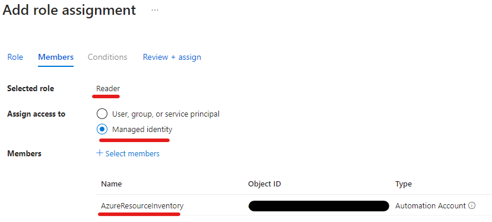
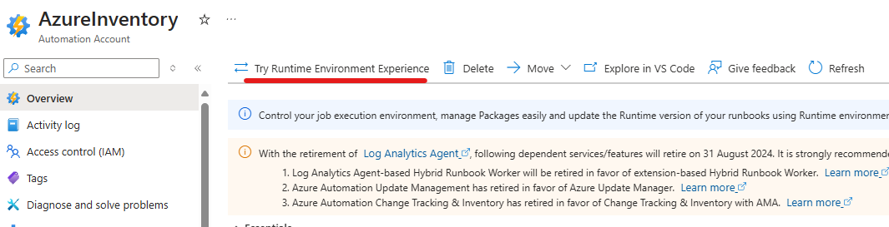
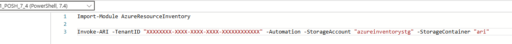

# Automation Guide

Azure Resource Inventory can be set up to run automatically using Azure Automation Accounts. This guide will walk you through the process of setting up an automated inventory system.

## Prerequisites

To run ARI as an Automation Account, you need:

1. An Azure Automation Account
2. An Azure Storage Account
3. A Blob Container inside the Storage Account

## Setup Process

### Step 1: Create an Automation Account

If you don't already have an Automation Account, create one in the Azure Portal.

### Step 2: Enable System-Assigned Identity

1. In your Automation Account, navigate to the **Identity** section
2. Enable the **System Assigned** identity

<div align="center">

</div>

### Step 3: Grant Required Permissions

The Automation Account's identity needs the following permissions:

#### Reader Access to Management Group

Grant the Automation Account's identity Reader access to your Management Group or subscriptions to enable resource inventory:

<div align="center">

</div>

#### Storage Blob Data Contributor

Grant the Automation Account's identity the "Storage Blob Data Contributor" role on your storage account:

<div align="center">

</div>

### Step 4: Configure Runtime Environment

1. In your Automation Account, go to **Runtime environments**
2. Switch to the new Runtime Environment Experience

<div align="center">

</div>

3. Create a new Runtime Environment

<div align="center">

</div>

4. Use PowerShell version **7.4** (recommended and tested)

### Step 5: Import Required Modules

In the "Packages" pane of your Runtime Environment, import the following modules from the gallery:

<div align="center">

</div>

1. AzureResourceInventory
2. ImportExcel
3. Az.ResourceGraph
4. Az.Accounts
5. Az.Storage
6. Az.Compute
7. Az.CostManagement (only if using the `-IncludeCosts` parameter)

### Step 6: Create a PowerShell Runbook

1. In your Automation Account, create a new PowerShell Runbook

<div align="center">

</div>

2. Add the Invoke-ARI command to the runbook:

<div align="center">

</div>

3. Make sure to select the Runtime Environment you created earlier

### Step 7: Configure the ARI Command

Add the Invoke-ARI command with the required parameters:

```powershell
Invoke-ARI -TenantID "XXXXXXXX-XXXX-XXXX-XXXX-XXXXXXXXXXXX" -Automation -StorageAccount "mystorageaccount" -StorageContainer "reports"
```

Required parameters:
- **TenantID**: Your Azure Tenant ID
- **Automation**: Indicates this is running in an Automation Account
- **StorageAccount**: The storage account where reports will be saved
- **StorageContainer**: The container within the storage account for reports

### Step 8: Schedule the Runbook

1. Save and publish your runbook
2. Create a schedule to run the runbook at your desired frequency

## Accessing Reports

The inventory reports will be automatically saved to the specified storage container. You can access them through the Azure Portal or using tools that connect to Azure Storage.

## Troubleshooting

If you encounter issues with your automated inventory:

1. Check the runbook logs for any error messages
2. Verify that the identity has all required permissions
3. Ensure all required modules are imported and up to date
4. Verify the storage account and container exist and are accessible

## Alternative Automation Options

As alternatives to Azure Automation Accounts, you can use these options to run ARI on a schedule:

### GitHub Actions

GitHub Actions provides a flexible way to automate ARI, especially if you're already using GitHub for infrastructure-as-code management. This approach is simpler to set up and maintain in GitHub-centric environments.

See the [GitHub Actions Guide](github-actions.md) for a complete walkthrough of setting up ARI with GitHub Actions.

### Azure DevOps Pipelines

Azure DevOps Pipelines offer another robust option for running ARI automatically, particularly well-suited for organizations already using Azure DevOps for their development and operations workflows.

See the [Azure DevOps Guide](azure-devops.md) for instructions on setting up ARI with Azure DevOps Pipelines. 