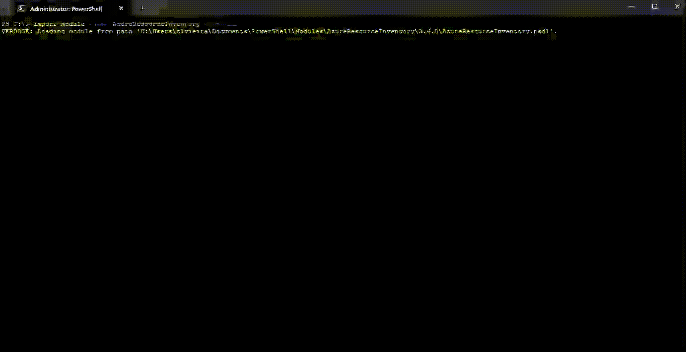

# Quick Start Guide

This quick start guide will help you generate your first Azure Resource Inventory report with just a few simple commands.

## Basic Usage

### Step 1: Import the Module

First, import the AzureResourceInventory module:

```powershell
Import-Module AzureResourceInventory
```

<div align="center">

</div>

### Step 2: Authenticate to Azure

If you're not already authenticated to Azure, ARI will prompt you to sign in when you run the command. Alternatively, you can authenticate explicitly first:

```powershell
Connect-AzAccount
```

### Step 3: Generate the Inventory

To generate a basic inventory report for all accessible resources and subscriptions:

```powershell
Invoke-ARI
```

<div align="center">

</div>

That's it! The command will:

1. Connect to your Azure environment
2. Collect information about all resources you have access to
3. Generate an Excel report with detailed tabs for each resource type
4. Create network diagrams (unless you use the `-SkipDiagram` parameter)
5. Save the report in your current directory

## Common Quick Start Examples

### Specify a Tenant

If you have access to multiple tenants and want to target a specific one:

```powershell
Invoke-ARI -TenantID <Your-Tenant-ID>
```

### Target a Specific Subscription

To limit the report to a single subscription:

```powershell
Invoke-ARI -SubscriptionID <Your-Subscription-ID>
```

### Include Resource Tags

To include all resource tags in your report:

```powershell
Invoke-ARI -IncludeTags
```

### Skip Network Diagram Generation

To speed up the process by skipping network diagram generation:

```powershell
Invoke-ARI -SkipDiagram
```

### Include Security Center Data

To include Security Center information in your report:

```powershell
Invoke-ARI -SecurityCenter
```

### Custom Report Name and Location

To specify a custom name and location for your report:

```powershell
Invoke-ARI -ReportName "MyAzureInventory" -ReportDir "C:\Reports"
```

## Understanding the Output

After running Invoke-ARI, you will get:

1. **Excel Report**: A comprehensive spreadsheet with tabs for each resource type
2. **Draw.io Diagrams**: Network topology diagrams in Draw.io format (if diagrams weren't skipped)

The report will be saved to your current directory by default, or to the location specified with the `-ReportDir` parameter.

## Next Steps

- Learn about all available [parameters](../user-guide/parameters.md)
- Explore [common usage scenarios](../user-guide/common-scenarios.md) 
- Set up [automated inventory reports](../advanced/automation.md) 