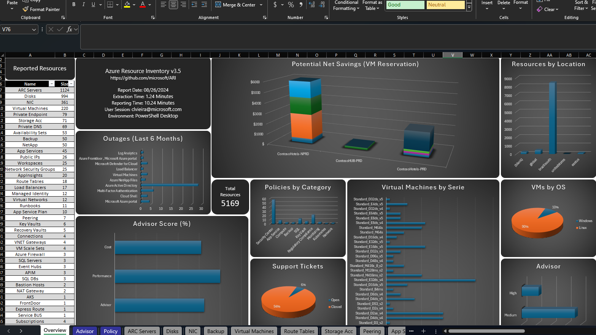
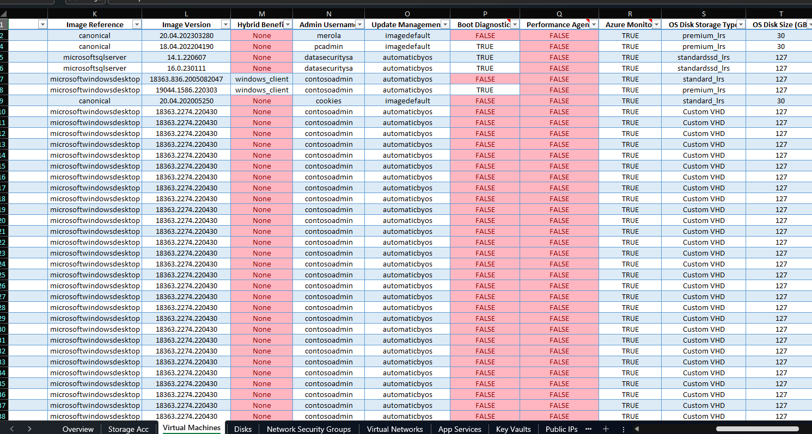
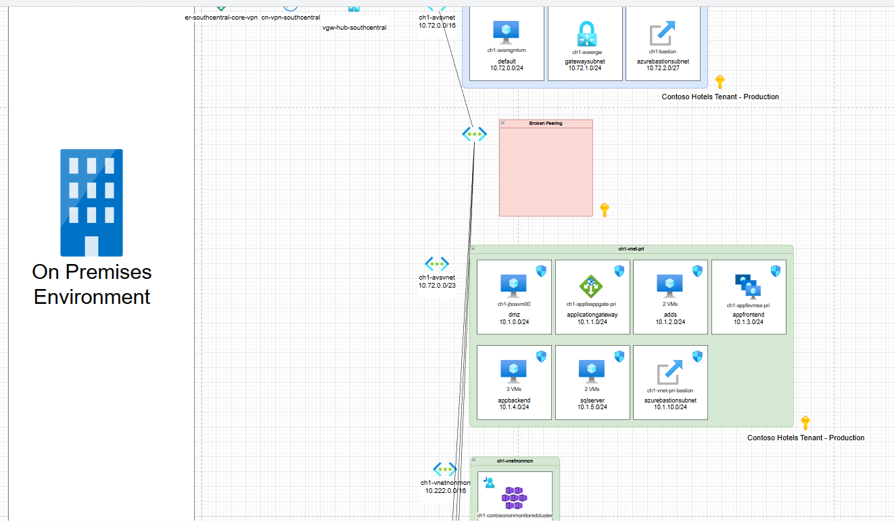
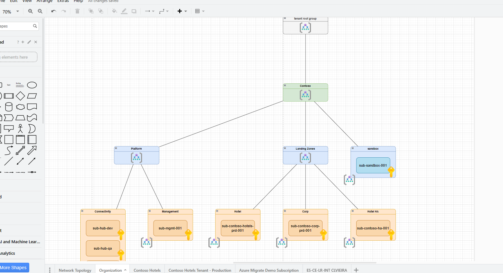
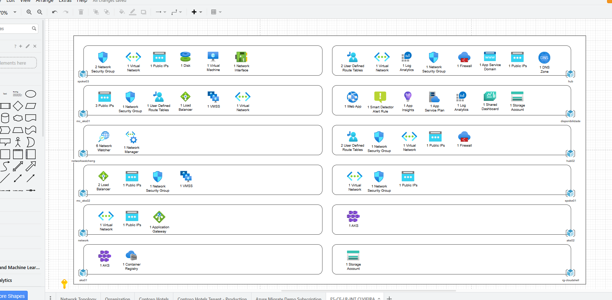

# Azure Resource Inventory (ARI)

## Overview

Azure Resource Inventory (ARI) is a comprehensive PowerShell module that generates detailed Excel reports of any Azure environment you have read access to. It is designed for Cloud Administrators and technical professionals who need an easy and fast way to document their Azure environments.

## Key Features

- **Complete Resource Documentation**: Detailed inventory of all Azure resources
- **Interactive Excel Reports**: Well-formatted spreadsheets with resources organized by type
- **Visual Network Diagrams**: Generate interactive topology maps of your Azure environment
- **Security Analysis**: Integration with Azure Security Center (optional)
- **Cross-Platform Support**: Works on Windows, Linux, Mac, and Azure Cloud Shell
- **Automation-Ready**: Can be deployed via Azure Automation Accounts
- **Low-Impact**: Read-only operations with no changes to your environment

## Quick Links

- [Installation Guide](getting-started/installation.md)
- [Quick Start](getting-started/quick-start.md)
- [Parameter Reference](user-guide/parameters.md)
- [Common Scenarios](user-guide/common-scenarios.md)
- [Automation Guide](advanced/automation.md)

## Output Examples

### Excel Report

### Network Topology View

Interactive features show resource details on hover:

### Organization View

### Resources View

 